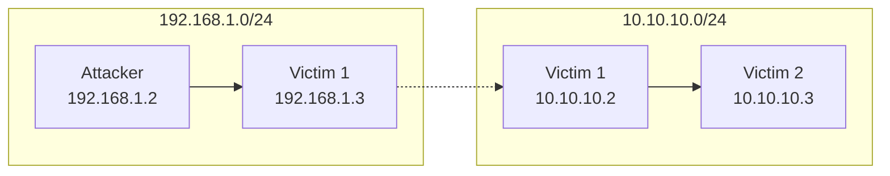

# 59 Pivoting Overview

- Pivoting is a post exploitation technique that involves utilizing a compromised host that is connected to multiple networks to gain access to systems within other networks.
- After gaining access to one host, we can use the compromised host to exploit other hosts on the same internal network to which we could not access previously.
- Meterpreter provides us with the ability to add a network route to the internal network's subnet and consequently scan and exploit other systems on the network.

## Port forwarding 

- Port forwarding is the process of redirecting traffic form a specific port on a target system to a specific port on our system.
- In the context of pivoting, we can forward a remote port on a previously inaccessible host to a local port on our Kali Linux system so that we can remotely interact/exploit the service running on the port. 

## Pivoting Visualized



### DEMO

```shell
meterpreter: ipconfig
meterpreter: run autoroute -s <target1-ip>/20 # Add route to a subnet
meterpreter: run autoroute -p # Show active routing table
meterpreter: background
msf6: auxiliary(scanner/portscan/tcp) # Scan tcp port from target1 to target2

# Port forwaring with MSF
msf6: sessions 1
meterpreter: portfwd add -l <local-port> -p <target2-port> -r <target2-ip>
# In a new local shell now with can scan with nmap
nmap -sV -p <local-port> localhost 
# Return in MSF
msf6: exploit(../../..) # Exploit for target2
```


#cybersecurity #eJPT 